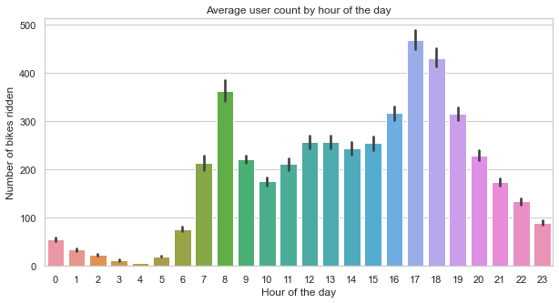

# Bike Sharing Demand

Bike sharing systems are a means of renting bicycles where the process of obtaining membership, rental, and bike return is automated via a network of kiosk locations throughout a city.The data generated by these systems makes them attractive for researchers because the duration of travel, departure location, arrival location, and time elapsed is explicitly recorded. Bike sharing systems therefore function as a sensor network, which can be used for studying mobility in a city. 

The data set was obtained from the Capital Bikeshare program in Washington, D.C. which contained the historical bike usage pattern with weather data spanning two years.

Predict the no of bike rides taken in a day depending on the weather conditions,time of the day,no of registered and non registered users.

**Results from the Exploratory Data Analysis:**

 

 

 

 

 

1. During Summer the most rides are taken.
2. The highest demand for bikes is from 7-10am and 3-7pm these being the office times for most metro cities.
3. The highest demand for bikes is when the temperature range is in between 30-35.

**Results from Regression Analysis:**
The results from all the models have been summarized below:

|                **Model**                | **R2 Score** | **MSE** | 
| :-------------------------------------: | :----------: | :-----------: | 
|        **Linear Regression** _\(default\)_   |    0.75   |    54\.64     |
|       **Lasso Regression** _\(default\)_     |    0.77   |    62\.92     |      
|      **Ridge Regression** _\(fine\-tuned\)_  |    0.85    |    80\.74     |       
|     **BaggingRegressor** _\(fine\-tuned\)_   |    0.86    |    86\.42     |       
| **RandomForestRegressor** _\(fine\-tuned\)_  |  **0.91**  |  **96\.72**   |     
| **XGBRegressor** _\(fine\-tuned\)_    |  **0.88**  |  **96\.72**   |     

**Comparing the MSE and R2 values for the different models:**
It can be seen that the Random Forest Regressor Model performs the best.
Using the Random Forest Regressor model given several time and weather considerations for the day we are able to predict the no of bikes that will rented on a particular day.

